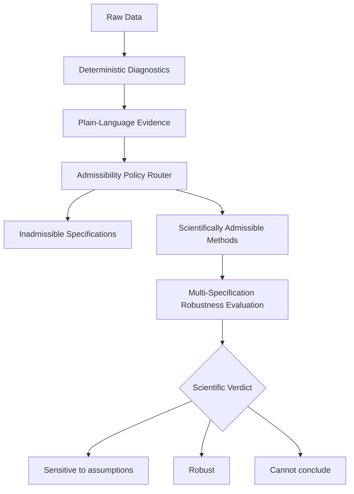
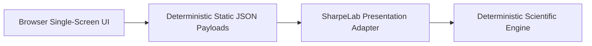

# Evidence-Routed Inference

> **AI that reasons explicitly about scientific assumptions.**

> **Evidence-Routed Inference tests whether a conclusion survives every scientifically admissible interpretation of the evidence.**

---

## 1. SharpeLab Interactive Demonstration

**SharpeLab** is the first interactive demonstration of Evidence-Routed Inference (ERI). It illustrates how automated scientific systems can prevent silent assumption failures in statistical inference.

```text
┌─────────────────────────────────────────────────────────────────────────────┐
│ EVIDENCE-ROUTED INFERENCE // AI for Scientific Assumptions                  │
│ SharpeLab — Interactive Demonstration                                       │
├─────────────────────────────────────────────────────────────────────────────┤
│ ACT 1 — THE MYSTERY                                                         │
│ Question: Can two honest experts reach opposite conclusions from the same data? │
│                                                                             │
│ [ INVESTIGATE ]                                                             │
├─────────────────────────────────────────────────────────────────────────────┤
│ ACT 2 — THE CONFLICT (Same Data, Opposite Conclusions)                      │
│ Analysis A (Naive IID)        : 95% CI [0.0008, 0.2497] -> SUPPORTED (CI > 0) │
│ Analysis B (HAC Dependence)   : 95% CI [-0.0415, 0.2921] -> NOT SUPPORTED    │
│                                                                             │
│ [ REVEAL HIDDEN ASSUMPTION ]                                                │
├─────────────────────────────────────────────────────────────────────────────┤
│ ACT 3 — PLAIN-LANGUAGE EVIDENCE MATRIX                                      │
│ 1. Finding     : Returns exhibit serial dependence.                         │
│ 2. Implication : Independence is not supported. Naive model is inadmissible.│
│ 3. Diagnostic  : Ljung-Box Q = 28.5140, p = 3.00e-06                        │
├─────────────────────────────────────────────────────────────────────────────┤
│ ACT 4 — SCIENTIFIC ADMISSIBILITY ROUTER                                     │
│ Naive IID Sharpe -> NOT SCIENTIFICALLY ADMISSIBLE                           │
│ Bartlett HAC     -> SUPPORTED BY EVIDENCE (PRIMARY)                         │
│ Block Bootstrap  -> SUPPORTED BY EVIDENCE (CROSS-CHECK)                     │
├─────────────────────────────────────────────────────────────────────────────┤
│ ACT 5 — SCIENTIFIC VERDICT: SENSITIVE TO ASSUMPTIONS                        │
│ "The apparent finding disappears when the inadmissible assumption is removed."│
├─────────────────────────────────────────────────────────────────────────────┤
│ ACT 6 — BEYOND FINANCE: A GENERAL ARCHITECTURE                              │
│ Applicable to Clinical Trials, Econometrics, Psychology, & Climate Science  │
└─────────────────────────────────────────────────────────────────────────────┘
```

---

## 2. The Problem

Standard statistical software and financial LLM tools compute inferences under unverified, implicit assumptions (such as independent and identically distributed returns). When data exhibit serial dependence, volatility clustering, or structural breaks, standard formulas fail silently—leading honest analysts to reach opposite conclusions from identical data.

---

## 3. What the Framework Does

Evidence-Routed Inference replaces unverified calculations with **evidence-governed assumption routing**:
1. **Evaluates Diagnostic Evidence**: Tests data against explicit mathematical assumptions (Ljung-Box Q, ARCH-LM, Split-Chow).
2. **Rules Out Inadmissible Models**: Marks specifications invalid when their underlying assumptions are contradicted by evidence.
3. **Tests Robustness Across Admissible Models**: Verifies whether a conclusion holds across all scientifically admissible methods.
4. **Emits Auditable Verdicts or Abstentions**: Emits a transparent verdict or abstains when data are scientifically incoherent.

---

## 4. Three Demonstration Outcomes

| Scenario Switcher Label | Data Process | Plain-Language Finding | Verdict Label | Takeaway |
| :--- | :--- | :--- | :--- | :--- |
| **Sensitive to assumptions** | AR(1) Serial Dependence ($N=250$, seed 4003) | Serial dependence present ($p = 3.00 \times 10^{-6}$) | **Sensitive to assumptions** | Naive IID is ruled inadmissible. Admissible robust intervals cross zero. |
| **Robust under volatility** | GARCH(1,1) Volatility Clustering ($N=300$, seed 4202) | Volatility clustering present ($p = 4.67 \times 10^{-5}$) | **Robust** | Naive IID is ruled inadmissible, but all admissible methods agree $CI > 0$. |
| **Cannot conclude** | Structural Mean Shift ($N=300$, seed 4303) | Structural break detected (Split-Chow) | **Cannot conclude** | Structural break violates stationarity; workflow abstains. |

---

## 5. How It Works



---

## 6. Quick Start & Local Setup

### Prerequisites
- Python 3.12+

### 1. Installation
```bash
python3 -m venv .venv
source .venv/bin/activate
pip install -e .
```

### 2. Build Payloads & Launch Server (One Command)
```bash
make sharpelab-demo
```
Then open your browser to: **`http://localhost:8080/ui/sharpelab/index.html`**

### 3. Run Verification Suite
```bash
make check
```

---

## 7. Architecture & AI Governance



> **AI Governance Note**: Structured AI agents may request and explain evidence, but deterministic scientific rules control eligibility, computation, and abstention.

---

## 8. Scientific Boundaries & Caution

This demonstration illustrates how Evidence-Routed Inference functions in financial Sharpe ratio estimation. **Caution**: This demo does not establish validated implementations in other scientific domains (such as clinical trials, climate science, or econometrics). Applying this framework to other fields requires domain-specific evidence rules and validated method catalogs.

---

## 9. Disclosures & Provenance

- **Synthetic Data Disclosure**: Demonstration scenarios use **illustrative fixed-seed synthetic data** generated under parametric specifications (AR1, GARCH, Structural Break) for deterministic replayability.
- **Frozen Demo Rule**: "Supported" means the full 95% confidence interval is above zero ($CI_{\text{lower}} > 0.0$).
- **Provenance Statement**: Extracted from the **Evidence-Routed Statistical Inference (ERI)** research codebase for standalone hackathon evaluation.

---

## 10. Repository Structure

```text
sharpelab-standalone/
  ├── README.md                          # Public framework & SharpeLab guide
  ├── NOTICE.md                          # Provenance & attribution notice
  ├── pyproject.toml                     # Python package build configuration
  ├── Makefile                           # Local build, test, & server targets
  ├── configs/                           # Typed diagnostic & policy configs
  ├── demo/sharpelab/                    # Tracked static JSON replay artifacts
  ├── docs/                              # Presentation & architecture docs
  │   ├── architecture-diagrams.md
  │   ├── demo-script.md
  │   ├── demo-storyboard.md
  │   └── sharpelab-hackathon-demo-plan.md
  ├── scripts/                           # Payload generator CLI script
  ├── src/sharpelab/                     # Standalone Python scientific package
  ├── tests/                             # Unit & integration test suite
  └── ui/sharpelab/                      # Offline 6-act HTML/CSS/JS explorer
```
