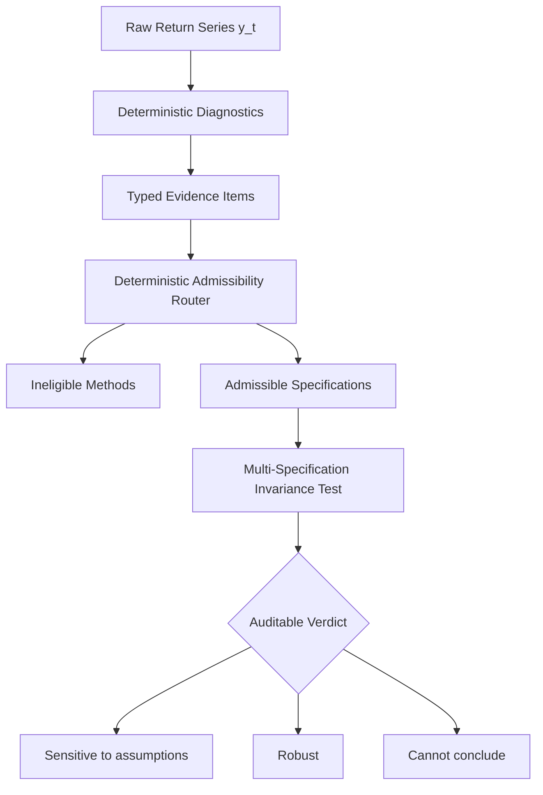

# SharpeLab

> **The data did not disagree. The assumptions did.**

> **SharpeLab tests whether a conclusion survives every scientifically admissible interpretation of the evidence.**

---

## 30-Second Explanation

Standard financial software computes Sharpe ratio confidence intervals under an implicit assumption that returns are independent and identically distributed (IID). When returns exhibit autocorrelation, volatility clustering, or regime breaks, standard formulas fail silently.

**SharpeLab** shifts the paradigm from unverified software calculations to **auditable, evidence-governed assumption routing**:
1. Evaluates return series against deterministic diagnostic tests (Ljung-Box Q, ARCH-LM, Split-Chow).
2. Disqualifies invalid inference models (e.g. marking Naive IID as *Not scientifically admissible* under autocorrelation).
3. Evaluates conclusion invariance across all scientifically admissible robust specifications (Bartlett HAC, Circular Block Bootstrap).
4. Issues an auditable verdict: **Sensitive to assumptions**, **Robust**, or **Cannot conclude**.

---

## Interface Preview

```text
┌─────────────────────────────────────────────────────────────────────────────┐
│ SHARPELAB // The data did not disagree. The assumptions did.               │
│ [Sensitive to assumptions]  [Robust under volatility]  [Cannot conclude]    │
├─────────────────────────────────────────────────────────────────────────────┤
│ 1. NARRATIVE HOOK: Naive IID vs Dependence-Aware Analysis                   │
│    Sharpe Estimate: 0.1253  |  Same Data  |  Opposite Conclusions           │
│                                                                             │
│ 2. CONFIDENCE INTERVAL VISUALIZER                                           │
│    Naive IID      :   |====●====|                     (Supported CI > 0)    │
│    Bartlett HAC   : <=|======●========|=>                 (Not Supp. CI <= 0)   │
│    Block Bootstrap: <=|=====●=======|=>                   (Not Supp. CI <= 0)   │
│                                                                             │
│ [ REVEAL HIDDEN ASSUMPTION ]                                                │
├─────────────────────────────────────────────────────────────────────────────┤
│ 3. TYPED EVIDENCE MATRIX: Ljung-Box Q p = 3.00e-06 (CONTRADICTS INDEPENDENCE)│
│ 4. ADMISSIBILITY ROUTE: Naive IID [Not Scientifically Admissible]           │
│ 5. FINAL VERDICT BANNER : SENSITIVE TO ASSUMPTIONS                          │
└─────────────────────────────────────────────────────────────────────────────┘
```

---

## Three Demonstration Outcomes

| Scenario Switcher Label | Data Process | Diagnostic Evidence | Verdict Label | Summary Takeaway |
| :--- | :--- | :--- | :--- | :--- |
| **Sensitive to assumptions** | AR(1) Serial Dependence ($N=250$, seed 4003) | Ljung-Box $p = 3.00 \times 10^{-6}$ (Contradicts IID) | **Sensitive to assumptions** | Naive IID is ruled inadmissible. Admissible robust confidence intervals cross zero. |
| **Robust under volatility** | GARCH(1,1) Volatility Clustering ($N=300$, seed 4202) | ARCH-LM $p = 4.67 \times 10^{-5}$ (Contradicts IID) | **Robust** | Naive IID is ruled inadmissible, but all admissible robust methods agree $CI > 0$. |
| **Cannot conclude** | Structural Mean Shift ($N=300$, seed 4303) | Split-Chow Test (Contradicts Stationarity) | **Cannot conclude** | Structural break triggers deterministic workflow abstention. |

---

## Scientific Architecture



---

## Quick Start & Local Setup

### Prerequisites
- Python 3.12+

### 1. Installation
Clone the repository and set up a virtual environment:
```bash
python3 -m venv .venv
source .venv/bin/activate
pip install -e .
```

### 2. Build Payloads (One Command)
Regenerate and validate static demonstration JSON payloads for all 3 scenarios:
```bash
make sharpelab-demo-build
```

### 3. Launch Visual Explorer
Start the local offline visual explorer HTTP server:
```bash
make sharpelab-demo
```
Then open your browser to: **`http://localhost:8080/ui/sharpelab/index.html`**

### 4. Run Tests
Execute unit and integration tests:
```bash
make test
```

---

## Disclosures & Provenance

- **Synthetic Data Disclosure**: Demonstration scenarios use **illustrative fixed-seed synthetic data** generated under parametric specifications (AR1, GARCH, Structural Break) for deterministic replayability.
- **Scientific Limitations**: The demonstration applies a frozen decision rule ($CI_{\text{lower}} > 0.0$ at 95% confidence). In production applications, decision hurdles are user-configurable.
- **Provenance Statement**: Extracted from the **Evidence-Routed Statistical Inference (ERI)** research codebase for standalone hackathon evaluation.

---

## Repository Structure

```text
sharpelab-standalone/
  ├── README.md                          # Public product landing page & guide
  ├── NOTICE.md                          # Provenance & extraction notice
  ├── pyproject.toml                     # Python package build configuration
  ├── Makefile                           # Local build, test, & server targets
  ├── configs/                           # Typed diagnostic & policy configs
  ├── demo/sharpelab/                    # Tracked static JSON replay artifacts
  ├── docs/                              # Presentation & architecture docs
  │   ├── architecture-diagrams.md
  │   ├── demo-script.md
  │   └── demo-storyboard.md
  ├── scripts/                           # Payload generator CLI script
  ├── src/sharpelab/                     # Standalone Python scientific package
  │   ├── adapter.py
  │   ├── config.py
  │   ├── data/
  │   ├── diagnostics/
  │   ├── inference/
  │   ├── orchestration/
  │   ├── routing/
  │   ├── schemas/
  │   └── simulation/
  ├── tests/                             # Unit & integration test suite
  └── ui/sharpelab/                      # Offline single-screen HTML/CSS/JS explorer
```
