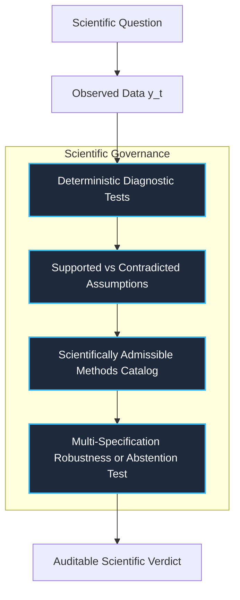
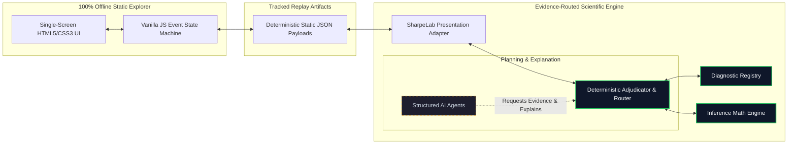

# Evidence-Routed Inference // Architecture Diagrams

> **Core Philosophy**: Deterministic scientific evidence rules and policy guardrails control method admissibility, computation, and abstention. Structured AI agents are subordinate to the deterministic core.

---

## 1. Conceptual Architecture Diagram

The conceptual flow illustrates how raw data are processed through diagnostic evidence testing and assumption routing to produce an auditable scientific verdict:

---

## 2. Implementation Architecture Diagram

The technical implementation architecture demonstrates the offline presentation stack, highlighting how AI agents operate subordinated to the deterministic scientific core:

---

## Technical Summary
- **Deterministic Core**: Scientific calculations, diagnostic p-values, and eligibility decisions are 100% reproducible and governed by typed Pydantic models.
- **Subordinate AI Agents**: AI agents formulate diagnostic plans and draft explanation texts, but cannot bypass diagnostic evidence rules or force admissibility of invalid methods.
- **Presentation Isolation**: The visual UI renders pre-validated static JSON payloads, ensuring fast, 100% offline demonstration replay.
