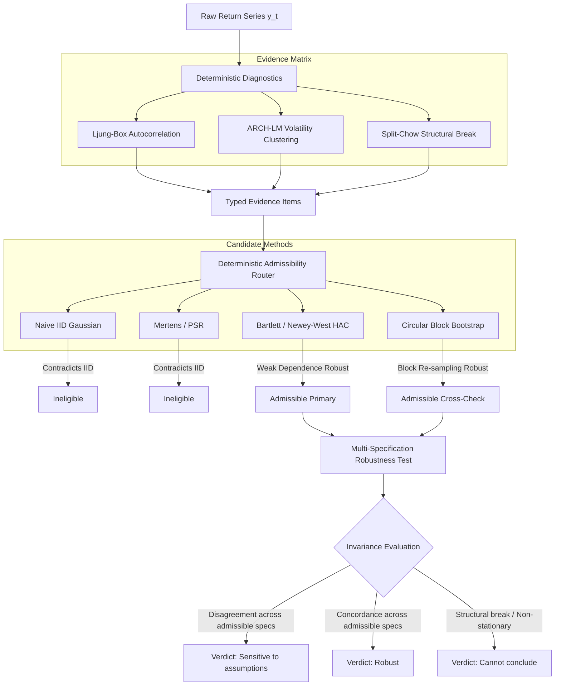
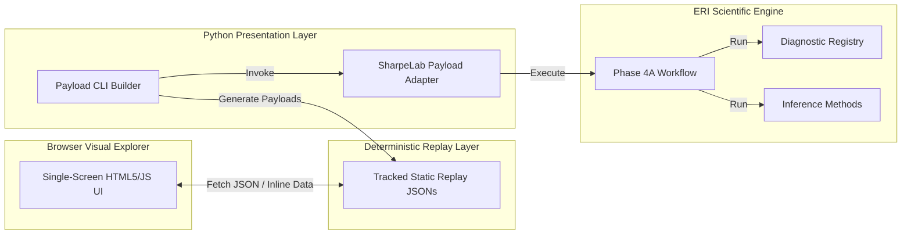

# SharpeLab Architecture Diagrams

## 1. Scientific Evidence & Robustness Pipeline

```mermaid
flowchart TD
    A[Raw Return Series y_t] --> B[Deterministic Diagnostics]
    
    subgraph Evidence Matrix
        B --> B1[Ljung-Box Autocorrelation]
        B --> B2[ARCH-LM Volatility Clustering]
        B --> B3[Split-Chow Structural Break]
    end
    
    B1 & B2 & B3 --> C[Typed Evidence Items]
    C --> D[Deterministic Admissibility Router]
    
    subgraph Candidate Methods
        D --> E1[Naive IID Gaussian]
        D --> E2[Mertens / PSR]
        D --> E3[Bartlett / Newey-West HAC]
        D --> E4[Circular Block Bootstrap]
    end
    
    E1 -- "Contradicts IID" --> F1[Ineligible]
    E2 -- "Contradicts IID" --> F2[Ineligible]
    E3 -- "Weak Dependence Robust" --> F3[Admissible Primary]
    E4 -- "Block Re-sampling Robust" --> F4[Admissible Cross-Check]
    
    F3 & F4 --> G[Multi-Specification Robustness Test]
    
    G --> H{Invariance Evaluation}
    H -- "Disagreement across admissible specs" --> I1[Verdict: Sensitive to assumptions]
    H -- "Concordance across admissible specs" --> I2[Verdict: Robust]
    H -- "Structural break / Non-stationary" --> I3[Verdict: Cannot conclude]
```

---

## 2. Technical Presentation Stack Architecture

```mermaid
flowchart LR
    subgraph Browser Visual Explorer
        UI[Single-Screen HTML5/JS UI]
    end
    
    subgraph Deterministic Replay Layer
        JSON[Tracked Static Replay JSONs]
    end
    
    subgraph Python Presentation Layer
        Adapter[SharpeLab Payload Adapter]
        Builder[Payload CLI Builder]
    end
    
    subgraph ERI Scientific Engine
        Workflow[Phase 4A Workflow]
        Diagnostics[Diagnostic Registry]
        Inference[Inference Methods]
    end
    
    UI <-->|Fetch JSON / Inline Data| JSON
    Builder -->|Generate Payloads| JSON
    Builder -->|Invoke| Adapter
    Adapter -->|Execute| Workflow
    Workflow -->|Run| Diagnostics & Inference
```
