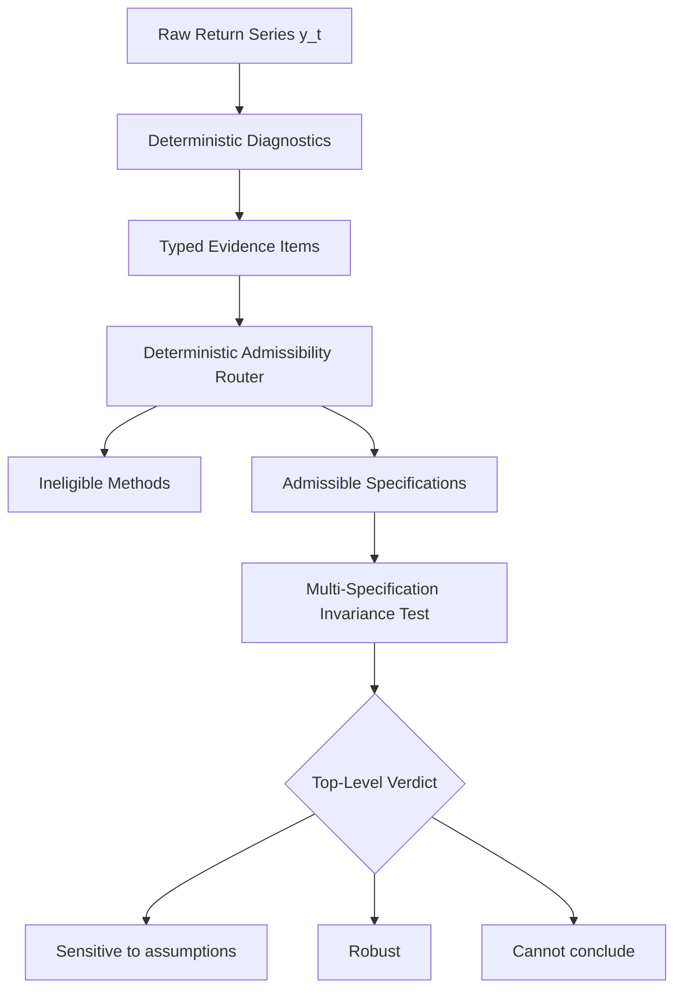
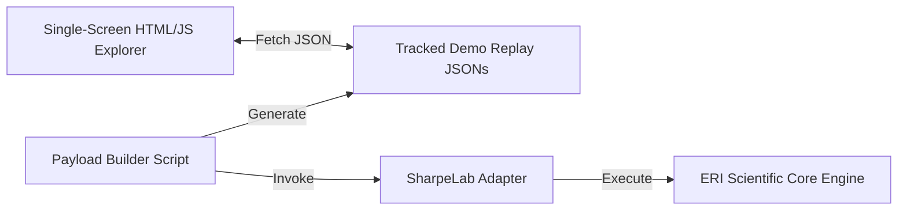

# SharpeLab

> **An auditable, evidence-governed assumption and robustness explorer for quantitative risk and performance analysis.**

---

## Overview

Statistical software usually computes a number when asked—even when the underlying mathematical model is completely invalid for the data. In quantitative finance, standard formulas calculate naive Sharpe ratio confidence intervals under an implicit assumption of independent, identically distributed (IID) Gaussian returns. When data exhibit autocorrelation, volatility clustering, or regime shifts, standard formulas fail silently.

**SharpeLab** shifts the paradigm from *“computing a number under unverified assumptions”* to *“auditing whether a conclusion survives every scientifically admissible interpretation of the data.”*

```text
The Sharpe estimate stayed the same (0.1253).
The uncertainty model changed (SE expanded by +34%).
The conclusion depended on an assumption that the data did not support.
```

---

## The Problem: Why Identical Data Produce Opposite Conclusions

1. **Identical Inputs**: Two analysts receive the exact same return series $y_t$.
2. **Hidden Assumptions**: Analyst A uses standard Gaussian software assuming independent returns. Analyst B uses Newey-West HAC standard errors allowing weak serial dependence.
3. **Conflicting Conclusions**: Analyst A reports a statistically significant positive Sharpe ratio ($CI = [0.0008, 0.2497]$). Analyst B reports that uncertainty expands (+34%), causing the confidence interval to cross zero ($CI = [-0.0415, 0.2921]$).
4. **The Audit Question**: *Which conclusion is scientifically admissible?*

---

## Interface & Key Visual Sections

```text
┌─────────────────────────────────────────────────────────────────────────────┐
│ SHARPELAB // The data did not disagree. The assumptions did.               │
│ [Sensitive to assumptions]  [Robust under volatility]  [Cannot conclude]    │
├─────────────────────────────────────────────────────────────────────────────┤
│ 1. NARRATIVE HOOK: Naive IID vs Dependence-Aware Analysis                   │
│    Sharpe Estimate: 0.1253  |  Same Data  |  Opposite Conclusions           │
│                                                                             │
│ 2. CONFIDENCE INTERVAL VISUALIZER                                           │
│    Naive IID      :   |====●====|                     (Supported CI > 0)    │
│    Bartlett HAC   : <=|======●========|=>                 (Not Supp. CI <= 0)   │
│    Block Bootstrap: <=|=====●=======|=>                   (Not Supp. CI <= 0)   │
│                                                                             │
│ [ REVEAL HIDDEN ASSUMPTION ]                                                │
├─────────────────────────────────────────────────────────────────────────────┤
│ 3. TYPED EVIDENCE MATRIX: Ljung-Box Q p = 3.00e-06 (CONTRADICTS INDEPENDENCE)│
│ 4. ADMISSIBILITY ROUTE: Naive IID [Not Scientifically Admissible]           │
│ 5. FINAL VERDICT BANNER : SENSITIVE TO ASSUMPTIONS                          │
└─────────────────────────────────────────────────────────────────────────────┘
```

---

## Three Demonstration Scenarios

SharpeLab demonstrates three distinct presentation-layer outcomes under frozen policy rules:

| Scenario | Switcher Label | Data Process | Diagnostic Evidence | Verdict Label | Core Takeaway |
| :--- | :--- | :--- | :--- | :--- | :--- |
| **Scenario 1** | **Sensitive** | AR(1) Serial Dependence ($N=250$, seed 4003) | Ljung-Box $p = 3.00 \times 10^{-6}$ (Contradicts IID) | **Sensitive to assumptions** | Naive IID is ruled inadmissible. Admissible robust methods show $CI$ crosses zero. |
| **Scenario 2** | **Robust** | GARCH(1,1) Volatility Clustering ($N=300$, seed 4202) | ARCH-LM $p = 4.67 \times 10^{-5}$ (Contradicts IID) | **Robust** | Naive IID is ruled inadmissible, but all admissible robust methods agree $CI > 0$. |
| **Scenario 3** | **Cannot conclude** | Structural Mean Shift ($N=300$, seed 4303) | Split-Chow Test (Contradicts Stationarity) | **Cannot conclude** | Structural instability triggers deterministic workflow abstention. |

---

## How It Works

SharpeLab operates through a 5-step scientific reasoning pipeline:

1. **Diagnostic Evidence Collection**: Runs deterministic tests for autocorrelation (Ljung-Box), heteroskedasticity (ARCH-LM), normality (Jarque-Bera), and stability (Split-Chow).
2. **Admissibility Evaluation**: Applies audited eligibility rules to disqualify invalid estimators (e.g. rejecting IID Gaussian under autocorrelation).
3. **Multi-Specification Execution**: Runs all admissible primary and sensitivity procedures (Bartlett HAC, Circular Block Bootstrap).
4. **Invariance Testing**: Evaluates whether the categorical decision (e.g. $CI_{\text{lower}} > 0.0$) remains invariant across admissible specifications.
5. **Verdict Issuance**: Emits an auditable top-level verdict (**“Sensitive to assumptions”**, **“Robust”**, or **“Cannot conclude”**).

---

## Architecture

### Scientific Reasoning Flow



### Technical Presentation Architecture



---

## Running Locally

### 1. Build Payloads
To regenerate and validate the static demonstration JSON payloads for all 3 scenarios:
```bash
make sharpelab-demo-build
```

### 2. Launch Visual Explorer
To start the local offline demo HTTP server:
```bash
make sharpelab-demo
```
Then open your browser to: **`http://localhost:8080/ui/sharpelab/index.html`**

---

## Scientific Limitations & Disclosures

- **Synthetic Data Disclosure**: All demo scenarios use **illustrative fixed-seed synthetic data** generated under parametric specifications (AR1, GARCH, Structural Break) for deterministic replayability.
- **Demo Decision Rule**: The demo applies a frozen decision rule ($CI_{\text{lower}} > 0.0$ at 95% confidence). In real-world applications, decision hurdles are user-configurable.
- **Agent Boundary**: Specialized Phase 4A agents audit prose provenance and plan diagnostic requests. The deterministic ERI core remains the sole authority over method eligibility, uncertainty math, and abstention.

---

## Repository Structure

```text
demo/sharpelab/                         # Tracked static replay JSON artifacts
  ├── ar1-assumption-sensitive.json
  ├── garch-robust.json
  └── structural-break-abstain.json
docs/                                  # Hackathon presentation documentation
  ├── sharpelab-hackathon-demo-plan.md  # Architectural master plan
  ├── demo-script.md                   # 3-minute live presentation script
  ├── demo-storyboard.md               # Video scene-by-scene storyboard
  ├── devpost-draft.md                 # Devpost submission draft
  └── architecture-diagrams.md         # Mermaid scientific diagrams
scripts/
  └── build_sharpelab_demo_payloads.py # Payload generator script
src/eri/demo/
  └── sharpelab_adapter.py             # SharpeLab presentation adapter
ui/sharpelab/                          # Single-screen web interface
  ├── index.html
  ├── styles.css
  ├── app.js
  └── README.md
```

---

## Future Work

- **Interactive Custom Dataset Uploads**: Extend the UI to support drag-and-drop CSV upload for custom return series.
- **Expanded Method Catalog**: Integrate non-parametric Cornish-Fisher, GARCH-in-mean, and bayesian predictive distributions into the admissibility catalog.
- **Multi-Asset Portfolio Governance**: Extend assumption routing from single return series to multi-asset covariance matrices and risk parity allocations.
